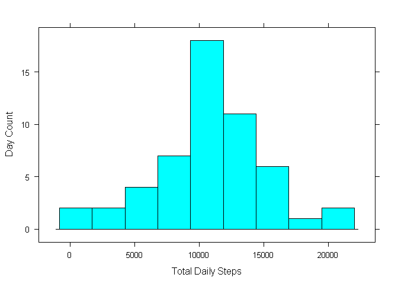
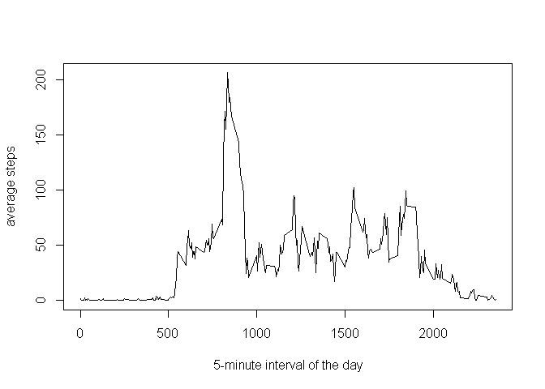
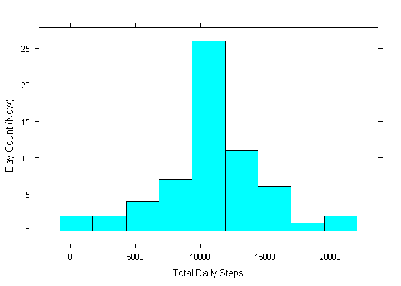
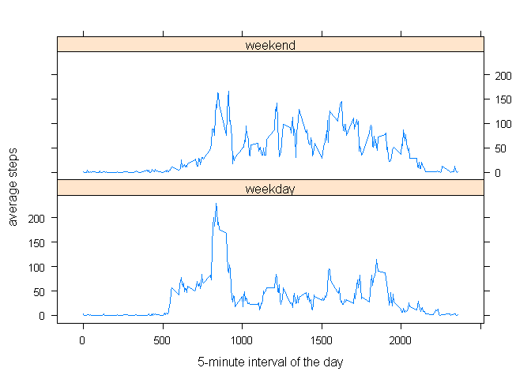

```r
knitr::opts_chunk$set(echo = TRUE)
```
## Load libraires

```r
library(lattice)
library(dplyr)
library(plyr)
library(lubridate)
```
## Loading and preprocessing the data
1. Load the data (i.e. `read.csv()`)  

```r
origdf <- read.csv(unzip("activity.zip"))
```
2. Process/transform the data (if necessary) into a format suitable for your analysis  
No process/transform needed yet.  

## What is mean total number of steps taken per day?
For this part of the assignment, you can ignore the missing values in  
the dataset.  
  
1. Make a histogram of the total number of steps taken each day  

```r
#Create data frame with sum of steps for each day.
bydaydf <- aggregate(steps~date,origdf,sum)

histogram(bydaydf$steps,xlab="Total Daily Steps", ylab= "Day Count", type= "count", nint=9)
```

<!-- -->
  
2. Calculate and report the **mean** and **median** total number of steps taken per day  

```r
mean1=mean(bydaydf$steps)
median1=median(bydaydf$steps)
```

 **Mean** is 10766.19 steps per day.   
 **Median** is 10765 steps per day.   
        

## What is the average daily activity pattern?
3. Make a time series plot (i.e. `type = "l"`) of the 5-minute interval (x-axis) and the average number of steps taken, averaged across all days (y-axis)  

```r
#Create data frame with average steps for each interval
byintervaldf <- aggregate(steps~interval,origdf,mean)
plot(byintervaldf$interval, byintervaldf$steps, type = "l", xlab = "5-minute interval of the day", ylab= "average steps")
```

<!-- -->

4. Which 5-minute interval, on average across all the days in the dataset, contains the maximum number of steps?  

```r
maxstepsint <- byintervaldf$interval[which.max(byintervaldf$steps)]
```

Interval number 835 contains the maximum number of steps accorss all days on average.  

## Imputing missing values  
5. Calculate and report the total number of missing values in the dataset.  

```r
nasum <- sum(is.na(origdf$steps))
```

The steps column has 2304 missing values.  

6. Devise a strategy for filling in all of the missing values in the dataset. The strategy does not need to be   sophisticated. For example, you could use the mean/median for that day, or the mean for that 5-minute interval, etc.   
  
Will fill in values using the mean for the 5-minute interval.

7. Create a new dataset that is equal to the original dataset but with the missing data filled in.  

```r
newdf <- origdf
 impute.mean <- function(x) replace(x, is.na(x), mean(x, na.rm = TRUE))
 newdf<-ddply(newdf, ~ interval, transform, steps = impute.mean(steps))
newdf<-arrange(newdf,date)
```

8. Make a histogram of the total number of steps taken each day. 

```r
#Create data frame with sum of steps for each day.
bydaydfnew <- aggregate(steps~date,newdf,sum)
histogram(bydaydfnew$steps,xlab="Total Daily Steps", ylab= "Day Count (New)", type= "count", nint=9)
```

<!-- -->

Calculate and report the **mean** and **median** total number of steps taken per day.  

```r
mean2=mean(bydaydfnew$steps)
median2=median(bydaydfnew$steps)
```

 The **new mean** is 10766.1887 steps per day.   
 The **new median** is 10766.1887 steps per day. 

Do these values differ from the estimates from the first part of the assignment? 

The **mean** went from 10766.1887 to10766.1887  

The **median** went from 10765 to10766.19  


What is the impact of imputing missing data on the estimates of the total daily number of steps? 

The **mean** changed by  0.  
The **median** changed by  1.1886792. 

The **absolute difference** between the median and the mean went from 1.1886792 to 0.    

## Are there differences in activity patterns between weekdays and weekends?

Use the dataset with the filled-in missing values for this part. 

9. Create a new factor variable in the dataset with two levels -- "weekday" and "weekend" indicating whether a given date is a weekday or weekend day.  


```r
dateymd<-ymd(as.character(newdf$date))
newdf<-mutate(newdf,date = dateymd)
newdf<-mutate(newdf,weekend = ifelse(wday(date)==7 | wday(date) ==1,"weekend","weekday"))
newdf$weekend<-as.factor(newdf$weekend)
```

1. Make a panel plot containing a time series plot (i.e. `type = "l"`) of the 5-minute interval (x-axis) and the   average number of steps taken, averaged across all weekday days or weekend days (y-axis).   

```r
#Create new data frame with average steps for each interval
byintervaldfnew <- aggregate(steps~interval+ weekend,newdf,mean)
xyplot(steps~interval | weekend, data=byintervaldfnew , type = "l", layout= c(1,2), xlab = "5-minute interval of the day", ylab= "average steps")
```

<!-- -->

